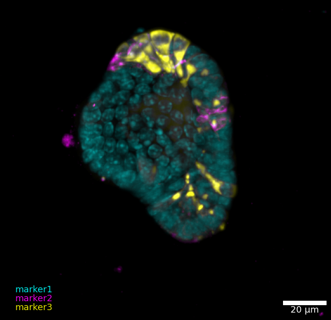
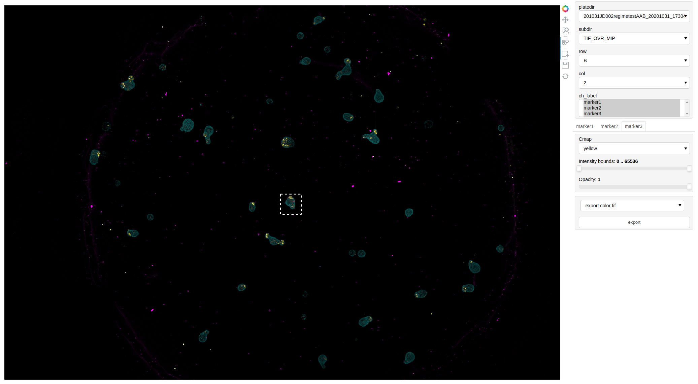
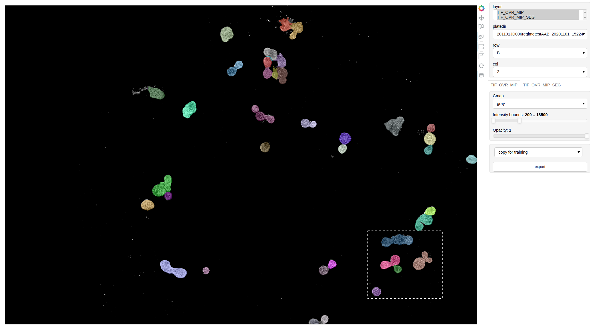
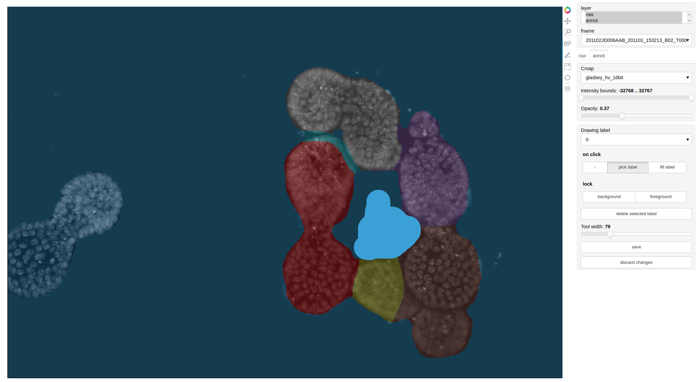
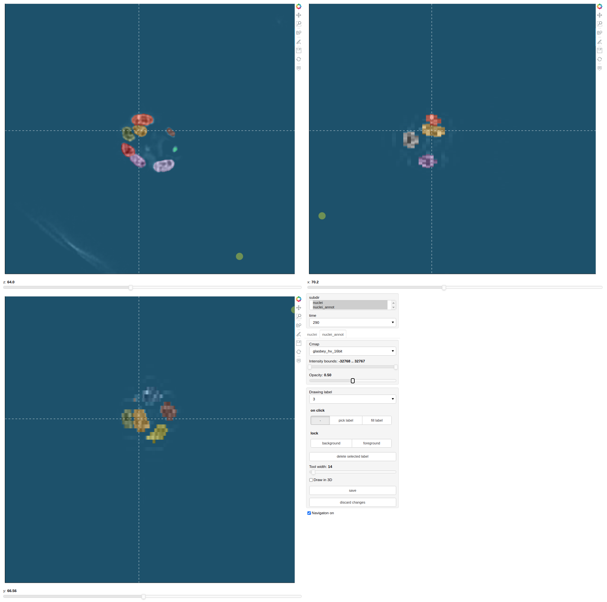
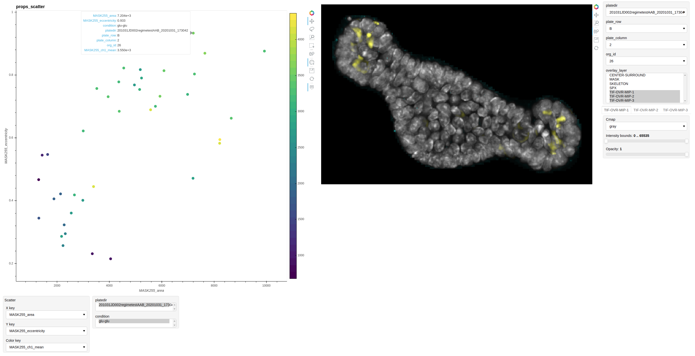

# Inter-View

Interactive visualization of bio-imaging data

## Installation
It is recommended to install this repository in a dedicated conda environment:

```bash
conda create -n viz python=3.7
conda activate viz
conda install -c pyviz holoviews bokeh panel param xarray datashader pytables

git clone https://github.com/fmi-basel/inter-view.git
pip install inter-view/
```

## Applications
Notebooks for existing use cases are available under `notebooks/applications`. These applications can be directly used as a notebook or, once configured, rendered in a browser with:

```bash
panel serve --show PATH_TO_NOTEBOOK.ipynb
```

or remotely:
```bash
panel serve --port PORT --allow-websocket-origin WORKSTATION:PORT PATH_TO_NOTEBOOK.ipynb
```  
<br/>

**TIF_OVR viewer:** Browsing through large TIF overviews and exporting RGB images.<br/>
<br/><br/>

**Segmentation viewer:** Inspecting segmentation labels and exporting mispredicted samples to retrain a deep learning network.<br/>
<br/><br/>

**2D annotator:** Tool to correct annotations and rapidly switch between samples. It also works directly on large (>10 000 px) images.<br/>
<br/><br/>

**3D annotator:** Tool to correct annotations of 3D stacks.<br/>
<br/><br/>

**Linked scatter plot:** Visualization of extracted features (e.g. area, eccentricity, mean intensity, etc.) with a link to the original images.<br/>
<br/><br/>

## Module usage
Examples of the available modules are provided in `notebooks/module_examples`. This is also intended as a makeshift unit test of the gui.

The repository is structured in sub-modules to load (`io`), view (`view_images`), and edit (`edit_images`) images. While these parts should be relatively modular/reusable, the `dashboards` sub-modules derives more complex applications that might sometimes be difficult to combine/extend.
